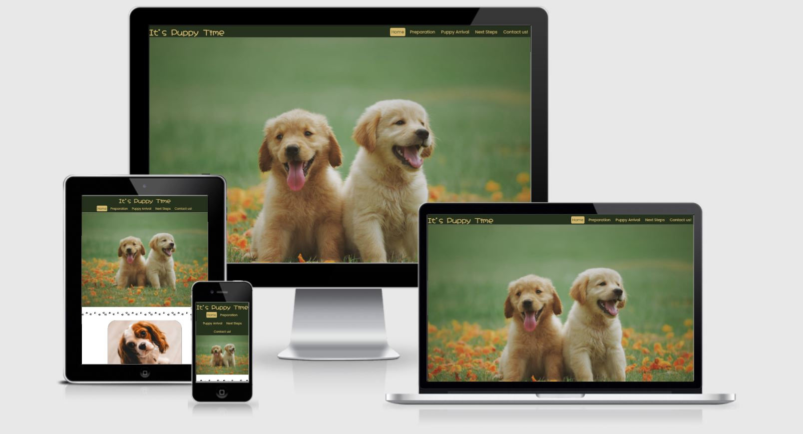

# It’s Puppy Time

"It's Puppy Time" is a one-stop shop for all your puppy orientated questions. It is an information website targetted at prospective and new puppy parents. It aims to make welcoming a puppy into the family easy by providing answers to queries and concerns regarding what to do and what to expect. As a relatively new puppy owner myself, I found that although all the information regarding puppy care is online, it is dispersed through-out. Thus my recent experiences and my puppy Pickle became the inspiration behind the creation of an easy to use website dedicated to puppy care.

# UX

## User Stories

* As a user visitng the site for the first time, I want to be able to navigate the website intuitively.
* As a user visiting the site for the first time, I want to know what kind of information is available and where to find it easily.
* As a user, I want to be able to access the website on desktop, tablet and mobile devices, to ensure high convenience.
* As a user, I want to be able to easily access the social media accounts of "It's Puppy Time" 
* As a user, I want to gain valuable insight and knowledge on what to do to prepare for a new puppy
* As a user, I want to know what to expect on the day I pick up the puppy
* As a user, I want to know what to do in the weeks after getting a puppy
* As a user, I want to be able to contact the website

## Project Goals

* Create a user-friendly and accessible website
* Create a familiar feeling website that leaves leaves a positive feeling
* Provide the user with useful information
* Divide the information into well thought out sections allowing the user to quickly find what they need
* Ensure the website is viewable across devices of all sizes.
* To create a website that would be immediately useful when live but also has scope to be expanded.

## Target Audience

The target audience of this website is any person who :

* is considering getting a puppy to help them decide
* has decided to get a puppy to help them prepare
* has got a puppy and wants advice of what to expect and what to do

## Structure

As the website is going to be heavy in information and text, it is therefore important to devide it into key sections across a number of pages. This is so that users do not feel overwhelmed by the text volume and can find the information they want easily.

The section idea was to divide into before getting a puppy, on the day you get a puppy, and after with a homepage. This lead to the following sections:

- Home Page: This sets the tone for the whole website in terms of style. Simple to navigate and helps users move to the section of the website they want.

- Preparation: Contains information regarding what to what to do before getting a puppy as well as what to buy

- Puppy Arrival: Contains information regarding how to care for a puppy on the first day you get it as well as the first night.

- Next Steps: Contains information regarding what to do with a puppy in the weeks and months after getting it

- Contact us: Gives users opportunity to provide feedback on the website or tell us their own experiences of getting a puppy.

## Skeleton

The initial ideas were taken from the structure planning and a visual mock up was created using Balsamiq. Mobile, Tablet, and Desktop wireframes are all available [here.](wireframes/wireframes.pdf).

There were improvements made to the structure from the wireframes to improve the user experience. These were :

- Changes to headings/titles
- The navigation bar does not stick on small screens as it takes up too much screen space.

## Surface

### Colour Palette

The main colours for the website are a dark green and a light golden yellow. These are colours you would find if you take your dog for walks in any countryside or woodland. I wanted the the colour scheme to help emphasise that getting a puppy is a fun and happy experience but it is also one which must be taken seriously.

- The dark green (#25311d) was chosen as the main background colour as it gives the website a natural earthy feeling. It also gives the website a slightly more luxious and serious feel.  

- The golden yellow (#d3b86e) was chosen for the text as it gives a youthful happiness feel through-out. 

Both of these colours were picked from the hero image for additional consistency using https://imagecolorpicker.com/.

### Typography

I chose font Hachi Maru Pop for all titles. This is an informal and cute handwritten font that works well at larger sizes. It was chosen to represent the fun and playfulness of puppies.

Using Googlefont popular pairings, I found Poppins. This was chosen as it works well with Hachi Maru Pop but has also looks more serious and is easier to read blocks of text.

### Language / Tone

The tone through-out is designed to be fun but concise. The information is given in the imperative tone as it is all important. However fun and casual use of language is chosen to keep with the overall feeling of the website. 

### Imagery

The pre-requisite for all images is that they needed to be of puppies! Once this key condition was met, the background colours in the photo needed to be earthy tones or light natural tones. This was to ensure consistency throughout.

### Layout

As the website is solely for the dissemination of information, I believed it was better created across multiple pages to represent the clearly defined chapters. This would prevent the user from being overloaded by text whilst allowing easier navigation.

# Features

## Existing Features

### Header

- Logo "It's Puppy Time" in large unmissable font sets the tone of the website.
- Navigation bar - Allows users to quickly see what content is available on the website and then navigate where they want is a simple, familiar and intuitive way. The current page is highlighted whilst the links are underlined when the cursor is on top. 
- Header is sticky on large devices but loses it's "stickiness" on smaller screens where you have less screen estate.

### Footer

- The Footer contains links to the "It's Puppy Time" social media websites. These open to a new tab upon click. The footer is set to stick once it becomes fully visible on the page. This was created to prevent the footer floating in the middle of the page.

### Vertial dividers

- Paw prints are used to separate all content vertically. There are additional paw prints throughout the homepage which are set to display:none which activate at smaller screens. These divide content into bitsize sections whilst keeping maintaining the style of the website.

### Home Page

- Hero image - Large image with two puppies sitting centrally is used to give users an immediate feeling of happiness and also show instantly what the website is about. The colour identity of the website is established between the header and the hero photo.

- Page summary tiles - Tiles were used to represent each different page. These tiles contained an image, the section title and a short summary of what will be found on that page. Each tile contains a button to take you to the relevant page. The tiles have curved corners for a softer looker. The curved edges are removed for smaller viewports.

- Contact tile - A smaller tile was chosen without an image as it is not the main purpose behind people visiting the website and so should not be the focus. This is in keeping with web norms. The tile has a button to take you to the contact us page. The tiles have curved corners for a softer looker. The curved edges are removed for smaller viewports.

### Preparation / Arrival Day / Next Steps

- Each of these pages contains the same layout in keeping with good user experience.
- The header, footer and vertical dividers detailed above
- A container with an image on the left, a header and content on the right.
- A container with an image on the right, a header and content on the left.

## Features to implement in the future

- Parallax scrolling video of a puppy running towards the camera to replace hero image.
- Add more content regarding how to care for a dog and not just a puppy

## Technologies Used

 ### Languages Used:

 - [HTML](https://en.wikipedia.org/wiki/HTML) - Programming language providing content and structure of website.

 - [CSS](https://en.wikipedia.org/wiki/CSS) - Programming language providing styling of website.

 ### Frameworks, Libraries & Programs Used:

    
 1. [GitPod](https://gitpod.io/)
    - IDE (Integrated Development Environment), for writing, editing and saving code.

 2. [GitHub](https://github.com/) 
    - Remote hosting platform and code  repository.

 3. [Balsamiq](https://balsamiq.com/):
    - Balsamiq was used to create the initial designs for the pages on the site.

 4. [Favicon](https://favicon.io/):
    - Favicon used to implement a favicon on the browser tab
 
 5. [Google Fonts](https://fonts.google.com/):
    - Google fonts were used to import both the Hachi Maru and Poppins fonts that are used on the site.

6. [Image Colour Picker](https://imagecolorpicker.com/)
    - Website which allows you to find the hexidecimal colour code of a colour in an image

7. [Pexels](https://www.pexels.com/search/puppies/) / [Unsplash](https://unsplash.com/)
    - Copywrite free stock images used throughout website

8. [TinyJPG](https://tinyjpg.com/)
    - TinyJPG used to create smaller versions of images enabling quickly load times.

9. [Am I Responsive?](http://ami.responsivedesign.is/)
    - Used to create 4 screen mock up image in Readme

10. [Google Developer Tools](https://developers.google.com/web/tools) - including Lighthouse
    - used to constantly test the code and give feedback. 

11. [Responsinator](https://www.responsinator.com/) 
    - Used to check responsiveness across multiple screen sizes quickly.

## Testing

The testing process can be seen in the [TESTING.md](TESTING.md) document.

## 5. Deployment

### Github Pages
The site is hosted using GitHub pages, deployed directly from the master branch of GitHub. The deployed site will update automatically as new commits are pushed to the master branch.

#### How I deployed my project to GitHub pages.
To host on GitHub pages you must follow these steps:

1. Go to [GitHub.com](https://github.com/)
2. Login to my account.
3. Click on 'Responsitories'
4. Click on 'itspuppytime'
5. Go to the 'Settings' tab
6. Scroll down to the 'GitHub Pages' section and set the source to 'Master Branch'. This turns on GitHub pages for the repository.
7. Reload the page. Scroll back to 'GitHub Pages' section, where the new URL for the deployed site can be found.

Additional information around these steps can be found on the [GitHub Pages Help Page](https://docs.github.com/en/github/working-with-github-pages/creating-a-github-pages-site).

#### Forking a GitHub Repository
1. Login to GitHub.
2. Locate your desired repository.
3. Locate the fork option in the top-right hand corner of the repository page.    
4. You will be asked where you want to fork it to.

