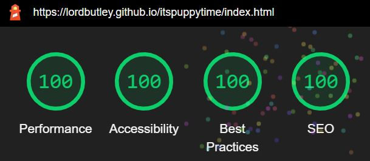
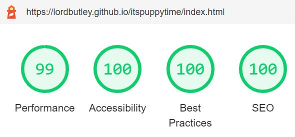

# Testing

 ## HTML

 - No errors were returned when passing through W3C HTML validator.

 - W3C (https://validator.w3.org/)

 ## CSS

 - No errors were returned when passing through W3C CSS validator.
 
 - W3C (https://jigsaw.w3.org/css-validator/validator)

    Live site was tested by checking all links across four screen widths.

 ## Lighthouse

When an initial Lighthouse audit was completed on all pages, scores of around 75 were given for performance. This was due to the images through-out the website. Consequently I re-sized all images and the average score for performance was raised to 99.

The scores on the initial audit for best practices were 93 on every page. This was due to an absolute file path being given to one of the four favicon links in the head element. Once changed to a relative file path, each page's score best practice score raised to 100.

After the two above bugs were fixed the average (across all pages) Lighthouse ratings were as follows:

Desktop:

Mobile:

## User Stories Testing
1. As a user visiting the site for the first time, I want to navigate the site intuitively.
    * A user can navigate to the landing page from any page in the website. Either via the navigation menu, or the logo in keeping with current UX norms
    * Each of the page links on the navigation bar become underlined when hovered over giving the user feedback.
    * The current page is highlighted in the navigation menu reminding users what page they are on.
    * On the homepage, there are highlighted buttons which take you to each relevant section. These also give users feedback by becoming underlined when hovered over. 
2. As a user visiting the site for the first time, I want to know what kind of information is available and where to find it easily.
    * A user can see the different pages available in the navigation bar. These sections are named accordingly.
    * A user can scroll down the homepage and see a short synopsis of each section of the website and is provided with another link to those pages.
3. As a user, I want to be able to access the website on desktop, tablet and mobile devices, to ensure high convenience.
    * Users who are browsing on Chrome, Safari, Microsoft Edge or Firefox can use the website on desktop, tablet and mobile devices with full responsiveness.
4. As a user, I want to be able to easily access the social media accounts of "It's Puppy Time"
    * A user can access the social media accounts of "It's Puppy Time" from the footer on every page. 
    * The icons provide feedback to the user.
5. As a user, I want to gain valuable insight and knowledge on what to do to prepare for a new puppy
    * A user can view information on how to prepare for a puppy by navigating to the "Preparation" page.
6. As a user, I want to know what to expect on the day I pick up the puppy
    * A user can find information regarding the first day with the puppy on the "Puppy Arrival" page
7. As a user, I want to know what to do in the weeks after getting a puppy
    * A user can find information regarding the care of a puppy after the first day on the "Next Steps" page.
    8.* As a user, I want to be able to contact the website
    * A user can contact the website on the contact us page by submitting the form after filling in their details and message.

## Manual Testing 

In order to ensure that the website is fully responsive across screen sizes, I used Google Developer Tools as well as Responsinator. I manually went through each page and checked through all potential break points starting with a large viewport and working my way down to 320px wide

  * Navigation - Repeated steps on all pages.
        * Click on logo to confirm that it navigates to landing page.
        * Click on all navigation links to verify that they direct to the indicated page.
        * Check that the header sticks to the top of the page
        * Check that the header is no longer sticky on smaller viewports
        * Check that the header's height becomes larger to encompass all text at small viewports.
        * Check that the alignment of text changes for smaller viewports
    
    * Footer - Repeated steps on all pages.
        * Check that the social media links open in a new tab.
        * Check that the footer does not raise higher than the bottom of the screen but is not permanently sticky across all viewports.
    
    * User feedback - Repeated steps on all pages
        * Check that the current page is the one highlighted in the navigation menu.
        * Check that all navigation links become underlined when hoved over
        * Check that all social media links are highlighted when hovered over

    * Landing page
        * Check that "Click Here" links direct to the pages intended
        * Check that "Click here" links underline when hovered over. Additionally check that this occurs when over any part of the button.
            - Check that the tiles align vertically as the screen width becomes smaller
            - Check that the curved edges of the tiles is removed once the tiles touch the edges of the viewport
    
      * Preparation / Arrival Day / Next Steps pages
        * Check that page loads correctly
        * Check that the layout changes to a vertical view at small viewports.

      * Contact
        * Check that all elements that are set to required are working.
        * Check that valid email address is needed with relevant '@' included.
        * Check that 'Submit' button works as required.
        * Check that the border-radius is removed for smaller viewports

      
     
